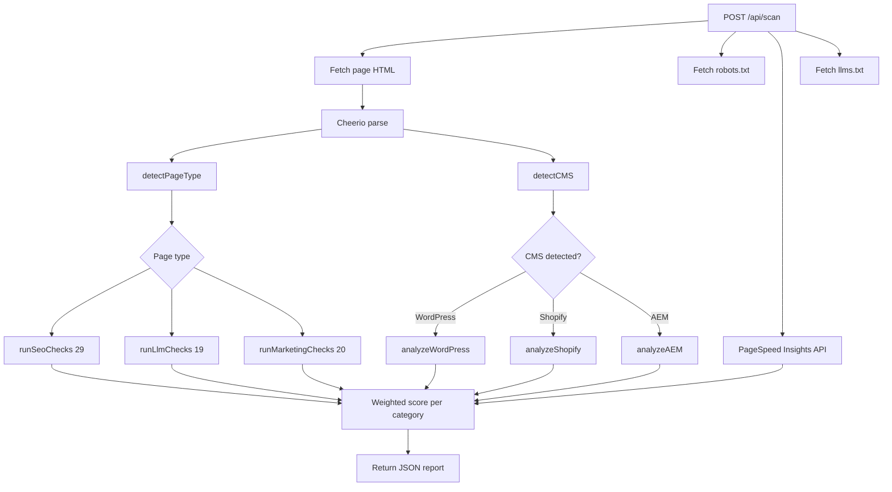

<div align="center">

# Trivium

**A full-stack website audit — technical SEO, LLM-readiness, and marketing effectiveness — in a single deterministic engine.**

[](https://siteauditpro.online)
[](https://siteauditpro.online)
[](LICENSE)
[](https://github.com/KaiMOdev/trivium/stargazers)
[](https://github.com/KaiMOdev/trivium/network/members)
[](https://github.com/KaiMOdev/trivium/issues)
[](https://github.com/KaiMOdev/trivium/pulls)
[](https://github.com/KaiMOdev/trivium/commits/main)
[](https://github.com/KaiMOdev/trivium/pulse)
[](https://github.com/KaiMOdev/trivium)
[](https://nodejs.org)
[](https://react.dev)
[](https://vitejs.dev)
[](https://expressjs.com)
[](CONTRIBUTING.md)
[](https://github.com/KaiMOdev/trivium/graphs/commit-activity)
[](https://github.com/KaiMOdev/trivium/actions/workflows/test.yml)
[](CODE_OF_CONDUCT.md)
[](https://github.com/KaiMOdev/trivium)

🌐 **[Hosted version](https://siteauditpro.online)** · 📚 **[Architecture](ARCHITECTURE.md)** · ⚙️ **[Setup](SETUP.md)** · 🤝 **[Contributing](CONTRIBUTING.md)** · 🏢 **[Lams IT Solutions](https://lamsitsolutions.be)**

</div>

---

> [!TIP]
> Try Trivium without installing anything — the hosted version at **[siteauditpro.online](https://siteauditpro.online)** runs the same engine plus AI-powered summaries and OAuth integrations.

---

## Table of Contents

- [About](#about)
- [Why Trivium?](#why-trivium)
- [How It Compares](#how-it-compares)
- [The Three Pillars](#the-three-pillars)
- [Features](#features)
- [Screenshot](#screenshot)
- [Quick Start](#quick-start)
- [Installation](#installation)
- [Configuration](#configuration)
- [Usage](#usage)
- [API Reference](#api-reference)
- [Scan Flow](#scan-flow)
- [Project Structure](#project-structure)
- [Tech Stack](#tech-stack)
- [Testing](#testing)
- [Deployment](#deployment)
- [Roadmap](#roadmap)
- [Contributing](#contributing)
- [FAQ](#faq)
- [Community & Support](#community--support)
- [Security](#security)
- [License](#license)
- [Commercial Use](#commercial-use)
- [Hosted Version](#hosted-version)
- [Contributors](#contributors)
- [Acknowledgements](#acknowledgements)
- [Maintainer](#maintainer)

---

## About

Trivium is a self-contained website audit engine designed for the AI-search era. It grades any URL against three orthogonal axes — technical SEO, LLM-readiness, and marketing effectiveness — and produces a structured, page-type-aware report with no signup and no external API calls.

The name comes from the classical [trivium](https://en.wikipedia.org/wiki/Trivium): grammar, logic, and rhetoric. Each pillar maps to one dimension of how a webpage performs in the modern discovery landscape.

## Why Trivium?

Most audit tools answer one of these questions:

- **Lighthouse / PageSpeed** — Is the page fast?
- **Screaming Frog / Sitebulb** — Is the page indexable?
- **Ahrefs / SEMrush** — How does the page rank?

Trivium asks a different one: **Is this page ready for how people actually find content in 2026?**

That includes Google, but it also includes ChatGPT, Claude, Perplexity, Google AI Overviews, and the rest of the post-keyword search surface. It includes whether your value proposition is specific enough for a human to convert *and* clear enough for an LLM to cite.

And it does all of it deterministically — no AI inference, no API keys, no third-party black boxes. Every score is reproducible from the page's HTML.

## How It Compares

| | Trivium | Lighthouse | Screaming Frog | Ahrefs / SEMrush |
| --- | --- | --- | --- | --- |
| Technical SEO checks | ✅ 29 | ⚠️ ~10 | ✅ ~100 | ✅ Many |
| LLM-readiness checks | ✅ **19** | ❌ | ❌ | ⚠️ Limited |
| Marketing / conversion checks | ✅ **20** | ❌ | ❌ | ⚠️ Limited |
| Page-type aware grading | ✅ | ❌ | ❌ | ❌ |
| Core Web Vitals | ✅ (via PSI) | ✅ Native | ✅ (via PSI) | ✅ |
| Multi-page crawl | ✅ | ❌ | ✅ | ✅ |
| CMS detection + enrichment | ✅ | ❌ | ⚠️ | ⚠️ |
| Runs offline | ✅ | ✅ | ✅ | ❌ |
| Open source | ✅ AGPL-3.0 | ✅ Apache-2.0 | ❌ Proprietary | ❌ Proprietary |
| Free for any use | ✅ | ✅ | ⚠️ Limited free tier | ❌ $99+/mo |
| Self-hostable | ✅ | N/A | N/A | ❌ |

Trivium is most directly complementary to **Lighthouse** — it uses PageSpeed data and adds LLM-readiness + marketing layers on top.

## The Three Pillars

### 🔧 Grammar — Technical SEO (29 checks)

**Is the page well-formed and indexable?**

Title tag · Meta description · H1 hierarchy · Canonical URL · Hreflang · Open Graph · JSON-LD schema · Schema currency · Schema completeness · Breadcrumb schema · Review schema integrity · robots.txt · Sitemap presence · Sitemap freshness · SSL certificate · Mobile viewport · Mixed content · Meta robots · Redirect chain · Image alt tags · Modern image formats · Responsive images · URL cleanliness · Content-to-code ratio · Internal linking · HTML lang attribute · Semantic HTML · Favicon & icons · Core Web Vitals (via Google PageSpeed Insights).

### 🤖 Logic — LLM Readiness (19 checks)

**Can an AI search system parse, cite, and quote the page?**

Content clarity · Answer capsules · Content extractability · Citation worthiness · Entity recognition · FAQ presence · Question-shaped headings · Definition clarity · Source attribution · Source citations · Author & expertise signals · WebSite / WebPage schema · Speakable schema · HowTo schema · AI bot accessibility (`GPTBot`, `ClaudeBot`, `PerplexityBot`, `Google-Extended`, `CCBot`, and others) · Content freshness · `llms.txt` presence · Content readability (Flesch-Kincaid) · Sentence complexity · Content accessibility.

### 🎯 Rhetoric — Marketing Effectiveness (20 checks)

**Will the page actually convert the visitors it earns?**

Value proposition specificity · CTA effectiveness · CTA copy quality · CTA-above-fold placement · Trust signals near CTAs · Social proof · Social proof signals · Headline formula quality · Benefit-vs-feature language · Urgency & scarcity cues · Emotional trigger words · Above-fold messaging · Contact visibility · Reviews & ratings · Video content · Form optimization · Accessibility landmarks · Typography quality · Color contrast · Logo detection · Font display optimization · Preconnect hints · Content structure consistency · Privacy & security signals · Image lazy loading.

## Features

- ✅ **Page-type aware** — Product pages, articles, contact pages, legal pages, and landings all graded differently. Irrelevant checks return `na` and don't drag the score.
- ✅ **Multi-page site scans** — Discover up to 5,000 pages via sitemap + BFS crawl. Stream results as NDJSON so the UI shows progress page-by-page.
- ✅ **Competitor comparison** — Scan up to 10 competitor URLs alongside yours, side-by-side.
- ✅ **CMS detection & enrichment** — Auto-detects WordPress, Shopify, Adobe Experience Manager, and generic CMS signals. Pulls extra signals from public REST APIs (no user credentials).
- ✅ **Core Web Vitals** — LCP, FID, CLS, TTFB, FCP, Speed Index via Google PageSpeed Insights.
- ✅ **PDF export** — White-label-friendly audit reports.
- ✅ **Site-wide pattern detection** — Surfaces issues that affect more than one page so you can fix them at the source.
- ✅ **Polite crawler** — Respects `robots.txt`, configurable delay between requests, SSRF protection for fetched URLs.
- ✅ **Zero-config dev** — `npm install && npm run dev` and you're scanning.

## Screenshot

> [!NOTE]
> Replace this section with an actual screenshot of the Trivium UI. Recommended: a hero-card showing the three pillar scores side-by-side after a real scan.

```
┌──────────────────────────────────────────────────────────────┐
│  Trivium                              [Scan] [Report] [...]  │
├──────────────────────────────────────────────────────────────┤
│                                                              │
│   ◯ 84/100        🔧 SEO        91 ▰▰▰▰▰▰▰▰▰▱   pass         │
│   Advanced        🤖 LLM        72 ▰▰▰▰▰▰▰▱▱▱   warn         │
│                   🎯 Marketing  87 ▰▰▰▰▰▰▰▰▱▱   pass         │
│                   ⚡ Perf       89 ▰▰▰▰▰▰▰▰▱▱   pass         │
│                                                              │
│   Title Tag  pass · 58 chars · keyword-front-loaded          │
│   FAQ Schema fail · No FAQPage structured data detected      │
│   ...                                                        │
└──────────────────────────────────────────────────────────────┘
```

## Quick Start

```bash
git clone https://github.com/KaiMOdev/trivium.git
cd trivium
npm install
cp api/.env.example api/.env
npm run dev
```

Open http://localhost:5173, enter any URL, and click **Scan**.

> [!IMPORTANT]
> Node.js 22 LTS is required. The build uses Vite 8 which dropped support for Node 18.

## Installation

### Prerequisites

| Tool | Version | Purpose |
| --- | --- | --- |
| [Node.js](https://nodejs.org) | 22.x LTS | Runtime for both the API (Express 5) and the frontend build (Vite 8) |
| npm | 10.x+ | Package manager (ships with Node.js) |
| Git | any recent | Cloning the repo |

### Clone and install

```bash
git clone https://github.com/KaiMOdev/trivium.git
cd trivium
npm install            # installs both api/ and app/ workspaces
```

### Run the dev servers

```bash
npm run dev            # starts api on :3001 and frontend on :5173 in parallel
npm run dev:api        # just the backend
npm run dev:app        # just the frontend
```

The Vite dev server proxies `/api/*` to the backend automatically.

### Build for production

```bash
npm run build          # outputs the frontend to app/dist/
npm start              # runs the api in production mode
```

## Configuration

All configuration is environment-variable based. Copy `api/.env.example` to `api/.env` and edit. **Every variable is optional** — Trivium works against any public URL out of the box.

| Variable | Default | What it does |
| --- | --- | --- |
| `PORT` | `3001` | API listen port |
| `NODE_ENV` | `development` | Switches between dev (CORS open) and production (CORS restricted to `FRONTEND_URL`, serves built frontend) |
| `FRONTEND_URL` | `http://localhost:5173` | Used for production CORS |
| `PSI_API_KEY` | — | Google PageSpeed Insights API key. Without it, falls back to the rate-limited anonymous endpoint. [Get one free](https://developers.google.com/speed/docs/insights/v5/get-started). |
| `PAGE_LIMIT` | `200` | Max pages per multi-page scan |
| `AUDIT_PAGE_LIMIT` | `5000` | Max pages per `/audit/discover` run |
| `AUDIT_DEPTH_LIMIT` | `10` | Max crawl depth |
| `SCAN_CONCURRENCY` | `3` | Parallel requests during multi-page scans |
| `CRAWL_DELAY_MS` | `300` | Politeness delay between requests |
| `SCAN_RATE_LIMIT` | `20` | Per-IP requests per minute for scan endpoints |

See [`SETUP.md`](SETUP.md) for deeper configuration notes.

## Usage

### Web UI

```bash
npm run dev
```

Then open http://localhost:5173 and use the interface:

- **Scan tab** — Single-page audit. Enter a URL and get a full report.
- **Page Audit tab** — Multi-page deep audit with site-wide pattern detection.
- **Report tab** — View the most recent scan results, export to PDF.

### Direct API

Trivium's backend is a plain HTTP API — call it from anywhere.

```bash
# Single-page scan
curl -X POST http://localhost:3001/api/scan \
  -H "Content-Type: application/json" \
  -d '{"url":"https://example.com"}'

# Multi-page scan with NDJSON streaming
curl -X POST http://localhost:3001/api/scan/site \
  -H "Content-Type: application/json" \
  -d '{"url":"https://example.com","pageLimit":25}'

# Competitor comparison
curl -X POST http://localhost:3001/api/scan/compare \
  -H "Content-Type: application/json" \
  -d '{"url":"https://you.com","competitors":["https://them.com"]}'
```

## API Reference

| Method | Endpoint | Description |
| --- | --- | --- |
| `GET` | `/api/health` | Liveness check |
| `POST` | `/api/scan` | Single-page audit. Returns full JSON result. |
| `POST` | `/api/scan/compare` | Up to 10 competitor URLs alongside the primary. |
| `POST` | `/api/scan/site` | Multi-page site scan. Streams NDJSON events: `status`, `discovery`, `page`, `complete`, `error`. |
| `POST` | `/api/audit/discover` | Deep page audit with `maxDepth`, `includePaths`, `excludePaths` filters. Streams NDJSON. |

Response shape for single-page scans:

```ts
{
  url: string;
  finalUrl: string;
  scannedAt: string;
  scores: { seo: number; llm: number; marketing: number; performance: number };
  seo: Check[];
  llm: Check[];
  marketing: Check[];
  performance: { score: number; metrics: Metric[]; opportunities: Opportunity[] };
  platform: { cms: { id: string; confidence: number } | null };
  wordpress: object | null;
  shopify: object | null;
  aem: object | null;
  readability: { fleschKincaid: number } | null;
  meta: { title: string; description: string; images: number; links: number; hasHttps: boolean };
  maturityLevel: "basic" | "intermediate" | "advanced";
}

type Check = {
  label: string;
  status: "pass" | "warn" | "fail" | "na";
  detail: string;
  score: number;
};
```

## Scan Flow



For site scans (`/api/scan/site` and `/api/audit/discover`) the flow repeats per page, streamed as NDJSON, with sitemap-driven URL discovery and BFS crawling at the front.

## Project Structure

```
trivium/
├── app/                              React 19 frontend (Vite, ESM)
│   ├── src/
│   │   ├── SiteAuditApp.jsx          Main dashboard component
│   │   ├── main.jsx                  Entry point
│   │   ├── components/               UI components (CheckRow, ScoreRing, etc.)
│   │   ├── checks/                   Frontend fallback mocks
│   │   ├── config/                   Theme, FAQ, explanations
│   │   ├── hooks/                    useScan, useScanHistory, usePageAudit
│   │   └── utils/                    PDF generation, recommendations
│   └── index.html
├── api/                              Express 5 backend (CommonJS)
│   ├── index.js                      Scan endpoints
│   ├── crawler.js                    fetchPage, parsePage, discoverPages
│   ├── checks/                       SEO, LLM, marketing, performance suites
│   ├── plugins/                      CMS detection (WordPress, Shopify, AEM)
│   ├── middleware/                   SSRF protection, rate limiting
│   ├── config/                       Scan limits, page-type applicability map
│   ├── utils/                        Page-type classifier, readability, helpers
│   └── __tests__/                    Jest test suite
├── ARCHITECTURE.md                   Deeper code tour
├── SETUP.md                          Detailed setup
├── CONTRIBUTING.md                   How to contribute
├── SECURITY.md                       Vulnerability reporting
├── CLA.md                            Contributor License Agreement
├── COMMERCIAL-LICENSE.md             Closed-source / proprietary use
├── CODE_OF_CONDUCT.md                Contributor Covenant 2.1
├── LICENSE                           GNU AGPL-3.0 (full text)
└── NOTICE                            Third-party attribution
```

## Tech Stack

| Layer | Technology |
| --- | --- |
| Frontend framework | [React 19](https://react.dev) |
| Build tool | [Vite 8](https://vitejs.dev) |
| Styling | Inline styles, custom dark theme — no UI library |
| Backend framework | [Express 5](https://expressjs.com) (CommonJS) |
| HTML parsing | [Cheerio](https://cheerio.js.org) |
| HTTP rate limiting | [express-rate-limit](https://express-rate-limit.mintlify.app/) |
| Performance metrics | [Google PageSpeed Insights API](https://developers.google.com/speed/docs/insights/v5/get-started) |
| PDF generation | [jsPDF](https://github.com/parallax/jsPDF) + [html2canvas](https://github.com/niklasvh/html2canvas) |
| Backend tests | [Jest](https://jestjs.io) |
| Frontend tests | [Vitest](https://vitest.dev) |
| Runtime | [Node.js 22 LTS](https://nodejs.org) |

## Testing

```bash
npm test               # runs both suites
npm run test:api       # backend only (Jest)
npm run test:app       # frontend only (Vitest)
```

CI runs on every pull request via [`.github/workflows/test.yml`](.github/workflows/test.yml).

> [!NOTE]
> A few pre-existing tests in the SEO / LLM / marketing scoring suites are inherited from the project's prior life and may fail on threshold mismatches. These are tracked and not blocking; new contributions should not introduce new failures.

## Deployment

Trivium is a normal Node + Vite app. Any Node 22 host works:

- **Render / Railway / Fly.io** — Single-service deploy. Run `npm run build` then `npm start`.
- **Vercel / Netlify** — Frontend as a static site, API as a separate service or serverless function.
- **VPS / bare metal** — `pm2 start api/index.js` behind nginx.

The repo intentionally does not ship a `fly.toml`, `vercel.json`, or any other infrastructure-as-config tied to a specific host — your deployment, your choice.

Set `NODE_ENV=production` and `FRONTEND_URL=https://your-domain.tld` in your environment. The API will serve the built frontend from `app/dist/`.

> [!WARNING]
> If you run a modified version of Trivium as a public-facing service, AGPL-3.0 requires you to publish your modifications. See the [License](#license) section.

## Roadmap

The OSS engine is feature-complete for the deterministic-audit use case. Planned improvements:

- [ ] Token-based design system to replace inline styles (still no UI library)
- [ ] CLI mode: `npx trivium audit https://example.com` for CI pipelines
- [ ] Pluggable check architecture so custom checks can be added without forking
- [ ] Optional persistence layer (SQLite by default) for scan history
- [ ] Internationalization of the report UI
- [ ] Browser extension (Chrome / Firefox) for one-click scanning
- [ ] Webhook notifications on threshold breaches

AI-powered features and OAuth integrations to Google Search Console / GA4 / Adobe Analytics / Meta Business are **intentionally out of scope** for the OSS engine — they live in the commercial product at [siteauditpro.online](https://siteauditpro.online).

## Contributing

Contributions are welcome and appreciated. See [`CONTRIBUTING.md`](CONTRIBUTING.md) for:

- Local development setup
- Branch naming conventions
- Adding a new check (step-by-step)
- Code style
- Pull request process

By submitting a PR you agree your contribution is licensed under AGPL-3.0-only. For dual-licensing eligibility, also sign the [Contributor License Agreement](CLA.md) — the [CLA Assistant](https://cla-assistant.io/) bot will prompt you on your first PR.

All contributors must follow the [Code of Conduct](CODE_OF_CONDUCT.md).

### Good first issues

Looking for somewhere to start? Check [issues tagged `good first issue`](https://github.com/KaiMOdev/trivium/issues?q=is%3Aissue+is%3Aopen+label%3A%22good+first+issue%22).

## FAQ

<details>
<summary><strong>Does Trivium send my scanned URLs to a third party?</strong></summary>

The only external call is to Google PageSpeed Insights for Core Web Vitals — same as every Lighthouse-based tool. If you set `PSI_API_KEY` your scans use your quota; if you don't, they use the anonymous (rate-limited) endpoint. Everything else runs locally against the page's HTML.
</details>

<details>
<summary><strong>How is this different from Lighthouse?</strong></summary>

Lighthouse audits one dimension (performance + accessibility + SEO basics) and runs in a headless browser. Trivium runs ~70 checks across three dimensions (SEO, LLM-readiness, marketing) against raw HTML and is page-type aware. They're complementary, not competing — Trivium uses Lighthouse data for Core Web Vitals.
</details>

<details>
<summary><strong>Why no AI in the OSS version?</strong></summary>

To keep the engine free-to-run with zero recurring cost. AI inference requires either an API key (cost passes to the user) or a hosted service (cost passes to us). The hosted version at [siteauditpro.online](https://siteauditpro.online) handles AI on our side — that's the commercial differentiator.
</details>

<details>
<summary><strong>Can I use Trivium for commercial purposes?</strong></summary>

Yes, with two paths:

1. **Open-source use under AGPL-3.0** — Free for any purpose, including commercial. If you run a modified version as a public service, you must publish your modifications under AGPL-3.0.
2. **Commercial license** — If AGPL doesn't work for your situation (embedding in closed-source products, policy restrictions, etc.), see [`COMMERCIAL-LICENSE.md`](COMMERCIAL-LICENSE.md).
</details>

<details>
<summary><strong>How accurate are the LLM-readiness scores?</strong></summary>

The deterministic checks (schema presence, AI-bot accessibility, content structure) are exact. The heuristic checks (citation worthiness, answer extractability) are calibrated against patterns observed in content that LLMs cite well. They're directional, not definitive. The commercial product adds AI-driven judgment checks on top for cases where heuristics fall short.
</details>

<details>
<summary><strong>Does Trivium support languages other than English?</strong></summary>

The scanner is language-agnostic — schema, technical SEO, and markup checks work on any language. A few text-based heuristics (readability, sentence complexity, headline analysis) are English-tuned. PRs welcome to add multilingual support.
</details>

<details>
<summary><strong>Can I run Trivium in CI?</strong></summary>

Yes. The API is a plain HTTP server you can hit with `curl`. A dedicated CLI is on the [roadmap](#roadmap) but you can already wire `POST /api/scan` into any pipeline that can hit an HTTP endpoint.
</details>

<details>
<summary><strong>Does Trivium replace my SEO tool?</strong></summary>

It complements rather than replaces traditional SEO suites. Ahrefs, SEMrush, and similar tools focus on off-page signals (backlinks, rankings, keyword research) that require historical data and crawlers at scale. Trivium focuses on on-page signals you can evaluate from one URL. Use both.
</details>

## Community & Support

- 🐛 **Bugs and feature requests** — [GitHub Issues](https://github.com/KaiMOdev/trivium/issues)
- 💬 **Questions and discussion** — [GitHub Discussions](https://github.com/KaiMOdev/trivium/discussions)
- 🔒 **Security vulnerabilities** — See [`SECURITY.md`](SECURITY.md). Use GitHub Security Advisories, do **not** open public issues.
- 💼 **Commercial licensing** — See [`COMMERCIAL-LICENSE.md`](COMMERCIAL-LICENSE.md) for contact details.

## Security

Trivium implements several defensive measures:

- **SSRF protection** — Fetches are restricted to public HTTP/HTTPS URLs; private IP ranges (RFC 1918) and metadata endpoints are blocked. See [`api/middleware/ssrf.js`](api/middleware/ssrf.js).
- **Rate limiting** — All scan endpoints are rate-limited per-IP (configurable via `SCAN_RATE_LIMIT`).
- **Input validation** — URLs are validated and length-capped at 2,048 chars; competitor lists capped at 10; arrays length-limited throughout.
- **No persistence** — The OSS engine doesn't store scan results, user data, or session state. There's nothing to leak.
- **Helmet headers** — Production responses set `X-Content-Type-Options`, `Strict-Transport-Security`, and friends.

For coordinated disclosure of vulnerabilities, see [`SECURITY.md`](SECURITY.md).

## License

Trivium is licensed under the **GNU Affero General Public License v3.0 (AGPL-3.0-only)**.

The full license text is in [`LICENSE`](LICENSE) and at https://www.gnu.org/licenses/agpl-3.0.txt.

### What AGPL-3.0 means in practice

| You can | You must |
| --- | --- |
| Use Trivium for any purpose, including commercial | Keep the copyright notice and AGPL-3.0 license intact |
| Modify the code | Publish your modifications under AGPL-3.0 |
| Distribute copies and modified versions | Make your modified source available to users of your service |
| Run Trivium as part of your own infrastructure | Provide source code to anyone interacting with your modified version over a network |

The key clause that makes AGPL different from GPL: **if you run a modified version of Trivium as a network service (SaaS, hosted tool, internal API accessible to others), you must offer the source of your modifications to users of that service.** This protects the project against being forked into a closed-source competing hosted service.

If this doesn't work for your situation, see [`COMMERCIAL-LICENSE.md`](COMMERCIAL-LICENSE.md).

Third-party dependencies are listed with their licenses in [`NOTICE`](NOTICE).

## Commercial Use

A commercial (non-AGPL) license is available for organizations that:

- Want to embed Trivium in a closed-source product
- Cannot comply with AGPL's source-disclosure requirement
- Need a private fork without AGPL obligations
- Have legal policies that disallow AGPL dependencies

See [`COMMERCIAL-LICENSE.md`](COMMERCIAL-LICENSE.md) for details and contact instructions.

## Hosted Version

A managed, hosted version of Trivium is available at **[siteauditpro.online](https://siteauditpro.online)**.

The hosted product extends this open-source engine with:

- 🤖 **AI-powered narrative summaries** — Claude-generated audit verdicts, critical-issue triage, and quick wins.
- 🔧 **Per-check AI fix suggestions** — Claude proposes ready-to-paste code snippets and copy fixes for failing checks.
- 🔌 **OAuth integrations** — Google Search Console, Google Analytics 4, Google Ads, Adobe Analytics, Meta Business (Pixel + Page Insights).
- 👥 **Team accounts, scan history, scheduled monitoring** — multi-user workspaces, historical trend tracking, weekly re-scans.
- 📧 **Email reports** — automated delivery to stakeholders.
- 📄 **White-label PDF exports** — agency-friendly reporting.

The OSS engine and the commercial product share the same audit core. If you want the engine on its own, you're in the right place. If you want the engine plus AI plus a team workspace, try the hosted version.

## Contributors

<a href="https://github.com/KaiMOdev/trivium/graphs/contributors">
  
</a>

Made with [contrib.rocks](https://contrib.rocks).

## Acknowledgements

- The [classical trivium](https://en.wikipedia.org/wiki/Trivium) — grammar, logic, and rhetoric — for naming.
- [Google PageSpeed Insights](https://developers.google.com/speed/pagespeed/insights/) for the Core Web Vitals data feed.
- The maintainers of [Cheerio](https://cheerio.js.org/), [Express](https://expressjs.com/), [React](https://react.dev/), and [Vite](https://vitejs.dev/) — Trivium is a thin shell over excellent open-source primitives.
- [Schema.org](https://schema.org/), the [W3C](https://www.w3.org/), and the various publishers of `llms.txt` who are shaping the standards Trivium audits against.
- Every site author who has thought about how their content reads to a machine — you make this useful.

## Maintainer

Trivium is built and maintained by **[Lams IT Solutions](https://lamsitsolutions.be)** — a Belgium-based software studio.

| | |
| --- | --- |
| 🌐 Company website | https://lamsitsolutions.be |
| 🚀 Hosted product | https://siteauditpro.online |
| 💻 This repository | https://github.com/KaiMOdev/trivium |
| 🐦 Follow updates | [GitHub Releases](https://github.com/KaiMOdev/trivium/releases) |

---

<div align="center">

**Built with ❤️ by [Lams IT Solutions](https://lamsitsolutions.be)**

Copyright © 2026 Lams IT Solutions · Released under [AGPL-3.0-only](LICENSE)

[⬆ Back to top](#trivium)

</div>
